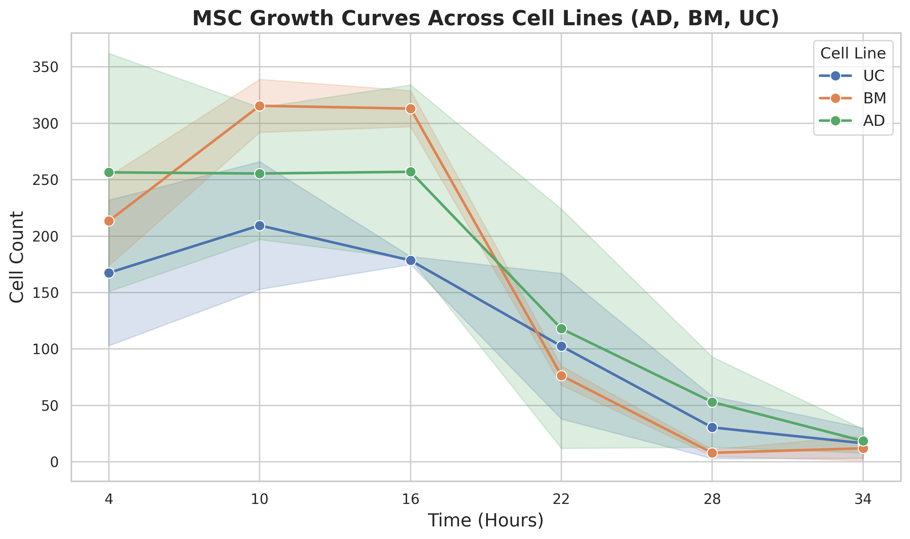

# multus-msc-pipeline

Automated MSC (Mesenchymal Stem Cell) counting and analysis pipeline using Cellpose.

## Visual Results

### MSC Growth Curve

### Representative Cell Detection (Overlays)
Below are examples of the automated cell detection on different cell lines:

| AD-E1 (t34) | BM-F11 (t34) | UC-H7 (t34) |
| :---: | :---: | :---: |
|  |  |  |

## Project Structure
- `data/`: Raw images for analysis (ignored by git).
- `notebooks/`: Jupyter Notebooks for local or Colab execution.
- `output/`: Analysis results, including cell counts and visualization overlays.
- `requirements.txt`: Python dependencies.

## Usage
1. Clone the repository.
2. Install dependencies: `pip install -r requirements.txt`.
3. Place images in `data/`.
4. Run the notebook in `notebooks/`.
